# SSAP — KISA 기준 취약점 진단·조치 자동화 플랫폼

> **S**ystem **S**ecurity **A**utomation **P**rogram
> KISA 주요정보통신기반시설 기술적 취약점 분석·평가 가이드를 기준으로 UNIX · WEB · DBMS 서버의 취약점을 **점검하고, 위험도에 따라 자동조치 또는 관리자 승인조치까지 수행**하는 Ansible 오케스트레이션 시스템입니다.


> 원본 저장소: [fkrdud1125/SSAP](https://github.com/fkrdud1125/SSAP)

- 다중 서버를 일괄 등록하고 Ansible로 **병렬 점검·조치**
- Ubuntu / Rocky Linux **OS 자동 식별**
- 저위험 항목은 **자동조치**, 서비스 영향이 있는 항목은 **관리자 승인 후 조치**
- **SSH Host CA** 인증서로 접속 대상 서버의 신원을 검증한 뒤에만 실행
- 결과를 **통합 JSON 스키마**로 표준화해 MySQL에 적재하고, 대시보드·Excel·PDF 보고서로 출력

---

## 목차

1. [프로젝트 배경](#1-프로젝트-배경)
2. [점검 범위](#2-점검-범위)
3. [기술 스택](#3-기술-스택)
4. [아키텍처](#4-아키텍처)
5. [동작 흐름](#5-동작-흐름)
6. [핵심 설계](#6-핵심-설계)
7. [실행 결과](#7-실행-결과)
8. [보고서](#8-보고서)
9. [코드 예시](#9-코드-예시)
10. [설치 및 실행](#10-설치-및-실행)
11. [안전 원칙](#11-안전-원칙)
12. [트러블슈팅](#12-트러블슈팅)
13. [한계 및 향후 개선](#13-한계-및-향후-개선)

---

## 1. 프로젝트 배경

국내 정보보호 시장은 약 3.45조 원에서 4.01조 원으로 16.1% 성장했고, ISMS-P 실증 심사 강화와 2027년 정보보호 공시 의무화 등 규제와 거버넌스 요구도 커지고 있습니다. KISA의 보안 취약점 클리닝 서비스, 미국 CISA의 Cyber Hygiene Services, 영국 NCSC의 Active Cyber Defence처럼 **취약점을 상시 점검하고 즉시 조치하도록 돕는 자동화 체계**가 확산되는 흐름에 맞춰, 서버 취약점 진단 업무를 자동화하는 것을 목표로 했습니다.

| AS-IS (수동 점검) | TO-BE (SSAP) |
| --- | --- |
| 서버마다 직접 접속해 반복 점검, 시간 소요 | KISA 기준 점검 항목 자동화 |
| 점검 결과를 수작업으로 수집 | Ubuntu · Rocky Linux 환경 자동 식별 |
| 점검자마다 판단 기준이 다름 | 서버 일괄 등록, Ansible 기반 다중 서버 병렬 점검 |
| 반복 작업으로 인한 시간 낭비 | UNIX · WEB · DBMS 항목을 서버/IP 단위로 선택 점검 |
| 조치 결과와 이력 관리가 어려움 | 위험도별 자동조치 + 관리자 승인조치, 결과 수집·시각화·보고서 자동 생성 |

**기대효과**: 수동·반복 점검 시간 단축, 다중 서버의 동일 기준 점검, 결과 누락 및 수작업 오류 방지, 취약 항목 조치 우선순위 파악, 보고서 자동 생성으로 보고 효율 향상.

---

## 2. 점검 범위

| 영역 | 항목 코드 | 점검 분류 | 대상 |
| --- | --- | --- | --- |
| **UNIX** | U-01 ~ U-67 | 계정 관리, 파일·디렉터리 관리, 서비스 관리, 패치 관리, 로그 관리 | Ubuntu 24.04 / 26.04, Rocky Linux 9 / 10 |
| **WEB** | WEB-01 ~ WEB-26 | 계정 관리, 서비스 관리, 보안 설정, 패치 및 로그 관리 | 웹 서버 |
| **DBMS** | D-01 ~ D-26 | 계정 관리, 접근 관리, 옵션 관리, 패치 관리 | MySQL 8.x |

> DBMS는 현재 MySQL만 지원합니다.

---

## 3. 기술 스택

| 구분 | 사용 기술 |
| --- | --- |
| 인프라 제어 | Ansible, Shell Script, SSH CA (ed25519) |
| 점검 대상 OS | Ubuntu Linux 24 · 26, Rocky Linux 9 · 10 |
| 백엔드 | FastAPI, MySQL (`kisa_console`) |
| 프론트엔드 | HTML, CSS, Vanilla JS |
| 데이터 포맷 | JSON, CSV, PDF, Excel |
| 네트워크 | Tailscale 기반 가상 네트워크 |

---

## 4. 아키텍처

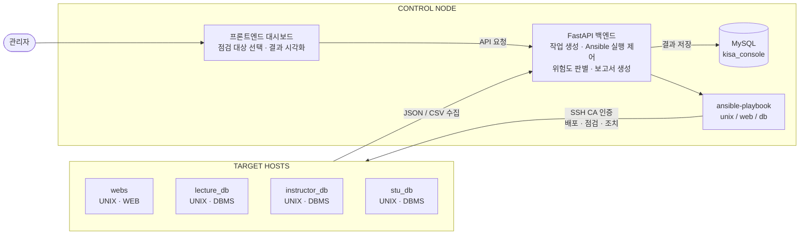

---

## 5. 동작 흐름

| 단계 | 내용 |
| --- | --- |
| 1. 프론트엔드 → API 호출 | Vanilla JS 대시보드가 FastAPI REST API 호출 |
| 2. 대상 · 영역 확인 | 백엔드가 대상 호스트와 진단 영역 판별 |
| 3. Playbook 실행 | 백그라운드 작업 러너가 영역별 Ansible Playbook 실행 |
| 4. 스크립트 배포 · 실행 | 대상 서버에 점검·조치 스크립트를 배포하고 실행 |
| 5. 결과 적재 | 표준 JSON 결과를 MySQL에 적재 |
| 6. 결과 · 점수 표시 | 대시보드가 취약 현황, 보안 점수, 실행 이력 렌더링 |
| 7. 보고서 생성 | 통합 Excel / PDF 보고서 다운로드 |

대상 서버에서 실행되는 점검·조치는 4단계로 나뉩니다.


---

## 6. 핵심 설계

### 6.1 진단 영역별 독립 프로젝트 구조

UNIX · WEB · DBMS가 같은 폴더 규칙을 공유합니다. 신규 진단 영역을 추가하기 쉽고, 기존 영역은 독립적으로 배포·검증할 수 있습니다.

```
backend/                  FastAPI, jobs, scoring, DB 저장, 영역별 작업/인벤토리 연결
frontend/                 Vanilla JS 정적 대시보드
inventory/hosts.ini       전체 자산을 역할별로 묶은 통합 인벤토리
unix/                     U-01 ~ U-67 Ansible 프로젝트
web/                      WEB-01 ~ WEB-26 Ansible 프로젝트
db/                       MySQL D-01 ~ D-26 Ansible 프로젝트
tests/                    test_runtime.py
ssap_reports.py           Excel 보고서 생성
```

| 영역 공통 디렉터리 | 역할 |
| --- | --- |
| `check/` | 읽기 중심 점검 스크립트 |
| `fix/` | 취약 설정 조치 스크립트 |
| `lib/` | 공통 Shell 함수 · 실행기 (`run_checks.sh`) |
| `playbooks/` | 배포 · 점검 · 조치 흐름 |
| `inventory/` | 대상 호스트 · 영역 변수 |
| `tools/` | 배포 릴리스 생성 |
| `reports/` | 점검 결과 출력 |

영역별 실행 경로와 플레이북 이름은 `backend/runtime.py` 한 곳에서 관리합니다. 대시보드에서 호스트를 등록하거나 삭제하면 `inventory/hosts.ini`(통합)와 `unix/`, `web/`, `db/`의 각 `inventory/hosts.ini`가 진단 영역에 맞게 동기화됩니다.

### 6.2 통합 JSON 스키마

진단 영역이 달라도 결과 필드 구조는 동일합니다. 이 스키마 하나를 DB · 백엔드 · 프론트엔드 · 채점 로직이 공유하므로 영역별 중복 구현을 최소화했습니다.

| 필드 | 예시 | 생성 위치 | 설명 |
| --- | --- | --- | --- |
| `code` | `WEB-04` | 점검 스크립트 | 코드 접두사로 진단 영역 구분 |
| `title` | 디렉터리 리스팅 비활성화 | 점검 스크립트 | 항목명 |
| `status` | 양호 · 취약 · fail | 점검 스크립트 | 판정 결과 |
| `action` | 점검 · 조치 | 점검 스크립트 | 호출 단계 |
| `detail` | manager 계정 없음 — 양호 | 점검 스크립트 | 판정 근거 |
| `os_type` | ubuntu 26.04 | 공통 라이브러리 | OS · 서비스 버전 |
| `timestamp` | 2026-08-26T10:20:07+09:00 | 공통 라이브러리 | 실행 시각 (ISO 8601) |
| `action_tag` | 자동조치 · 승인요청 | 점검 스크립트 | 조치 권한 게이트 |
| `impact` | 재접속 정보 갱신 필요 | 점검 스크립트 | 조치 시 예상 영향 |
| `severity` | 상 · 중 · 하 | 점검 스크립트 | 채점 가중치 (10 · 8 · 6) |
| `release_hash` | e28e739c… (SHA-256) | `run_checks.sh` | 배포 릴리스 버전 |
| `duration_seconds` | 1 | `run_checks.sh` | 실행 소요 시간(초) |

### 6.3 자동조치와 승인조치의 분리

| 비교 기준 | 자동조치 | 승인조치 |
| --- | --- | --- |
| 서비스 영향 | 영향 없이 적용 | 접속 · 세션에 영향 가능 |
| 변경 위험 | 저위험 · 가역적 | 고위험 · 비가역적 |
| 운영 상태 | 정상 운영 중 실행 | 장애 가능성 사전 검토 |
| 판단 · 복구 | 즉시 롤백 가능 | 관리자 승인 후 실행 |

승인조치 항목은 선택된 항목 코드와 확인 플래그가 모두 있어야 실행되며, 모든 영역에서 `playbooks/remediate_approved.yml`을 사용합니다.

### 6.4 SSH Host CA 기반 접속 대상 검증

기존 Ansible 설정은 서버 지문 검증을 생략해 빠르게 실행할 수 있었지만, 잘못된 서버에도 점검·조치가 실행될 수 있었습니다. 서버마다 지문을 확인하는 대신 **CA의 서명을 신뢰**하도록 바꿨습니다.

| 단계 | 내용 |
| --- | --- |
| 1. CA 준비 | ed25519 Host CA 생성, 개인키는 `0600` 권한으로 격리 |
| 2. 서버 신원 서명 | hostname · IP를 principal로 포함, 인증서 유효기간 52주 |
| 3. 안전 배포 | 백업 → 설치 → `sshd -t` 문법 검사 → reload, 실패 시 즉시 원복 |
| 4. 재검증 후 실행 | CA 서명 · 대상 · 만료 여부 확인, 성공한 서버만 점검 시작 |

미서명 · 만료 · 불일치 서버는 자동 차단되고, 서버 수와 관계없이 CA 공개키 한 줄로 동일한 신뢰 기준을 적용합니다. 승인 · 서명 · 배포 · 검증 결과는 단계별로 기록됩니다.

### 6.5 보안 점수

항목별 `severity` 가중치(상 10 · 중 8 · 하 6)를 반영해 IP별 · 영역별 보안 점수를 100점 만점으로 환산하고 등급(우수 · 양호 등)을 표시합니다.

---

## 7. 실행 결과

시연 환경(대상 서버 2대) 기준 결과입니다. 스크린샷의 서버 IP는 마스킹 처리했습니다.

| 지표 | 결과 |
| --- | --- |
| 전체 점검 항목 | 170건 |
| 취약 항목 | 13건 (승인 필요 11건 · 자동조치 2건) |
| 양호율 | 91.8% |
| 평균 보안 점수 | 91.5점 (instructor_db 92.2점 · webs 90.8점) |
| 조치 후 점수 | 자동조치 후 92.9점 → 승인조치 후 100점 |

### 사용자 로그인

관리자 계정 기반으로 인증하며, 비인가 사용자의 관리 기능 접근을 통제합니다.

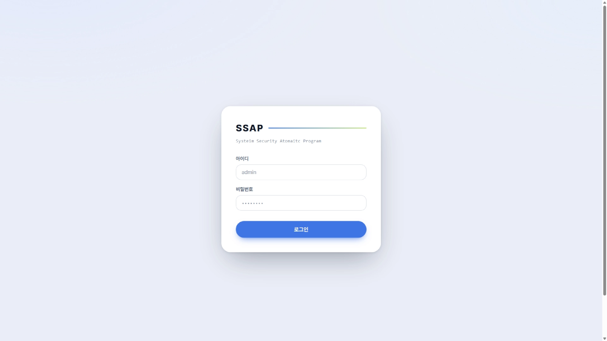

### IP 등록

서버 IP · 호스트명 · 진단 영역을 단일 또는 일괄 등록합니다. 등록 결과는 인벤토리로 자동 동기화되고, 서버별 Host CA 인증 상태와 접속 상태를 확인할 수 있습니다.

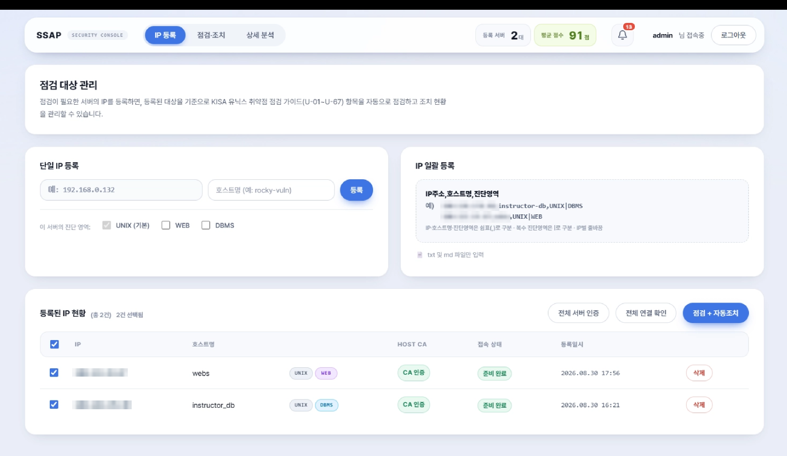

### 점검 · 조치

진단 영역별 취약 현황과 분류별 취약 건수를 보여주고, 자동조치와 승인요청 항목을 구분해 후속 조치를 진행합니다. 조치 업데이트에서 항목별 변경 내용과 백업 경로를 확인할 수 있습니다.

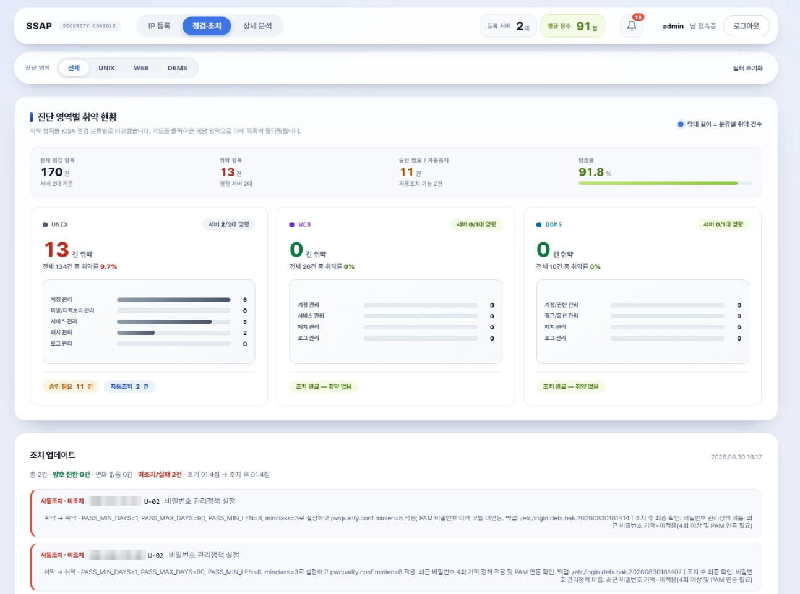

### 상세 분석

IP별 보안 점수와 등급, 양호 · 취약 현황을 비교하고, 취약 항목의 상세 내용과 조치 상태를 확인합니다.

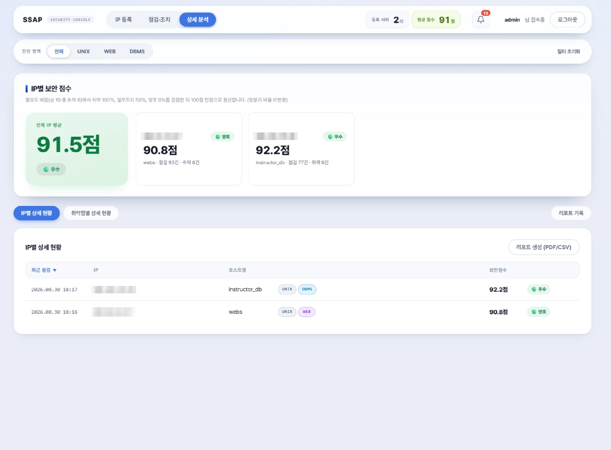

### SSH CA 인증

등록된 서버에 Host CA 인증서를 배포하고 인증 상태를 확인하는 과정입니다. ([시연 영상](docs/media/ssh_ca_demo.mp4))

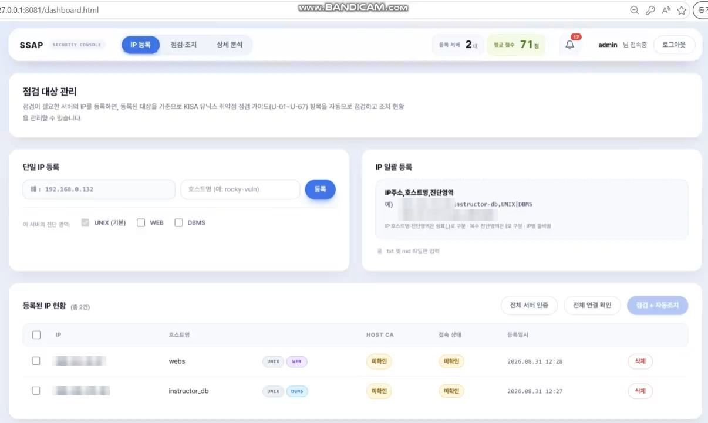

---

## 8. 보고서

같은 점검 데이터를 목적에 따라 두 가지 보고서로 출력합니다.

| 구분 | PDF — 선택 대상 중심 리포트 | Excel — 전체 현황 통합 문서 |
| --- | --- | --- |
| 용도 | 상세 분석 탭에서 필요한 범위만 빠르게 추출 | 전체 서버 결과를 한 번에 정리하는 관리용 파일 |
| 범위 | IP 또는 취약점 코드 단위로 선택, 양호·취약 또는 취약만 필터링 | 클릭 시점의 DB 결과로 매번 새 파일 생성 |
| 특징 | 미리보기 후 PDF 저장, 제출·공유용 | 파일명에 생성 일시 포함, 작업 로그와 SHA-256 해시 표시 |

### PDF 상세 결과 보고서

서버 · 영역별 보안 점수와 취약 현황을 요약하고, 항목별 판정 근거 · 상세 결과 · 조치 내용을 페이지 단위로 정리합니다.

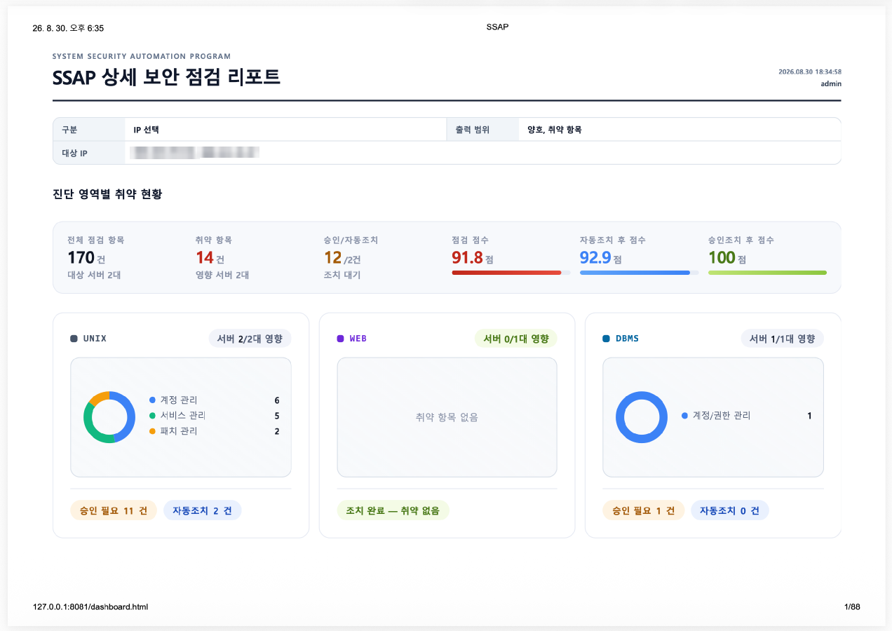

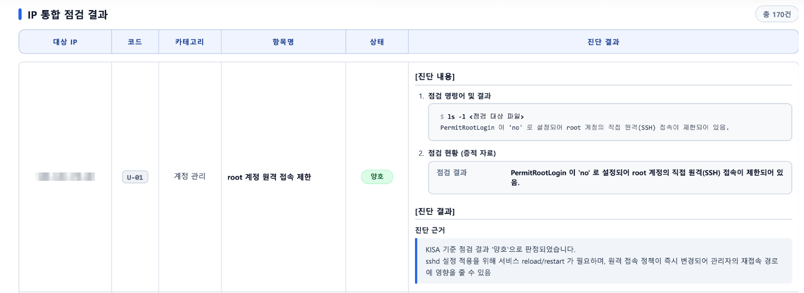

### Excel 통합 보고서

`ssap_reports.py`가 단일 생성 코드입니다. 다운로드 파일명은 `ssap_reports_YYYYMMDD_HHMM.xlsx` 형식입니다.

| 시트 | 내용 |
| --- | --- |
| 표지 Dashboard | 전체 요약 · 차트 |
| 자산현황 목록 | 등록 서버 · 진단 영역 현황 |
| 조치 항목 | 자동 / 승인요청 조치 목록 |
| 서버 상세 | 서버별 점검 항목 상세 |
| 참고 가이드 | 항목별 설명 · 조치 가이드 |
| 작업 증적 | 로그 · SHA-256 검증 결과 |

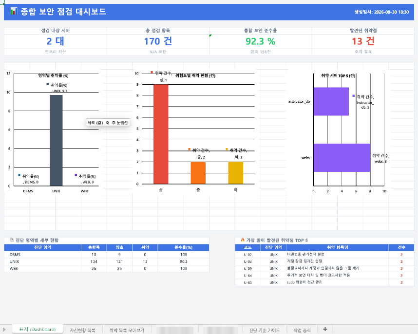

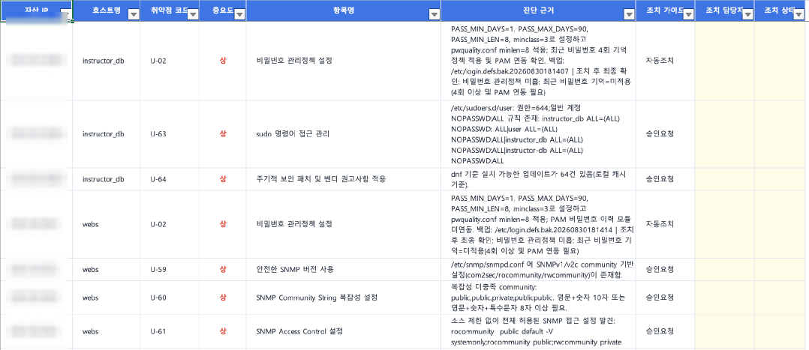

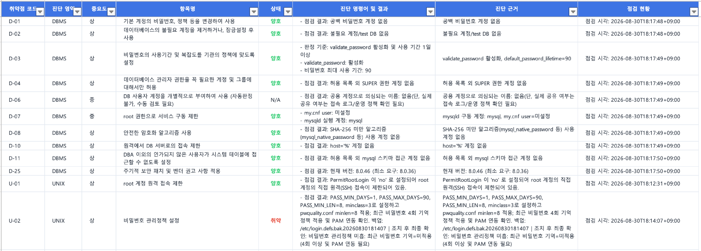

---

## 9. 코드 예시

### 점검 스크립트 — U-01 root 계정 원격 접속 제한

`PermitRootLogin` 값을 기준으로 양호 · 취약을 자동 판정합니다.

```bash
case "$val" in
    no|prohibit-password|without-password)
        CHECK_DETAIL="PermitRootLogin 이 '${val}' 로 설정되어 root 계정의 직접 원격(SSH) 접속이 제한되어 있음."
        return "$KISA_EXIT_GOOD"
        ;;
    yes)
        CHECK_DETAIL="PermitRootLogin 이 'yes' 로 설정되어 root 계정의 SSH 직접 접속이 허용되어 있음."
        return "$KISA_EXIT_VULN"
        ;;
    "")
        CHECK_DETAIL="PermitRootLogin 설정이 존재하지 않아 OpenSSH 기본값(버전에 따라 prohibit-password 또는 yes)이 적용됨. 명시적 제한이 없어 취약으로 판단."
        return "$KISA_EXIT_VULN"
        ;;
    *)
        CHECK_DETAIL="PermitRootLogin 값 '${val}' 을(를) 해석할 수 없어 취약으로 보수적으로 판단."
        return "$KISA_EXIT_VULN"
        ;;
esac
```

### 조치 스크립트 — U-01

관리자 승인이 없으면 조치를 보류하고, 승인된 경우에만 `PermitRootLogin no`를 적용합니다.

```bash
if [ "$ACTION_TAG" = "승인요청" ] && ! is_approved; then
    FIX_DETAIL="관리자 승인 필요(action_tag=승인요청): sshd 설정 변경 및 서비스 reload가 필요한 항목이라 자동 조치를 보류함.
    승인 후 KISA_APPROVAL=true 로 재실행하거나, 수동으로 ${SSHD_CONFIG} 에 'PermitRootLogin no' 설정 후 sshd 를 reload 하세요."
    return 1
fi

if grep -qiE '^[[:space:]]*PermitRootLogin[[:space:]]' "$SSHD_CONFIG"; then
    sed -i -E 's/^[[:space:]]*PermitRootLogin[[:space:]].*/PermitRootLogin no/I' "$SSHD_CONFIG"
else
    printf '\nPermitRootLogin no\n' >> "$SSHD_CONFIG"
fi
```

### 점검 플레이북 — `check.yml`

`run_checks.sh`를 원격 호출 1회로 실행해 67개 항목을 한 번에 점검하고, 결과의 개수 · 중복 · 누락을 검증합니다.

```yaml
- name: 배치 runner로 67개 점검 실행 (원격 호출 1회)
  ansible.builtin.command:
    cmd: "{{ kisa_remote_active_dir }}/lib/run_checks.sh"
  environment:
    KISA_CHECK_ITEM_TIMEOUT: "{{ kisa_check_item_timeout | string }}"
  register: kisa_check_batch
  changed_when: false
  failed_when: kisa_check_batch.rc != 0

- name: 배치 점검 결과 완전성 검증 (67개, 중복/누락 없음)
  ansible.builtin.assert:
    that:
      - kisa_results | length == 67
      - kisa_results | map(attribute='code') | unique | list | length == 67
      - kisa_results | map(attribute='code') | list == query('sequence', 'start=1 end=67 format=U-%02d')
    fail_msg: >-
      배치 runner 결과가 완전하지 않습니다. 결과 수={{ kisa_results | length }},
      codes={{ kisa_results | map(attribute='code') | list | join(',') }}
```

### 점검 결과 JSON

코드 · 상태 · 상세 내용 · 심각도 · 조치 유형을 동일 형식으로 출력하며, 서버별 결과를 중앙에서 수집해 화면 표시와 보고서 생성에 사용합니다.

```json
{
  "action": "점검",
  "action_tag": "승인요청",
  "code": "U-01",
  "detail": "PermitRootLogin 이 'yes' 로 설정되어 root 계정의 SSH 직접 접속이 허용되어 있음.",
  "duration_seconds": 0,
  "evidence_data": {
    "점검 결과": "PermitRootLogin 이 'yes' 로 설정되어 root 계정의 SSH 직접 접속이 허용되어 있음."
  },
  "impact": "sshd 설정 적용을 위해 서비스 reload/restart 가 필요하며, 원격 접속 정책이 잘못 변경되면 관리자의 원격 접속 경로에 영향을 줄 수 있음",
  "os_type": "ubuntu 26.04",
  "release_hash": "e94d2541b6c6de993c05b9f6b74bf657c7bf2306f8a2e21d5a760ca7849336ba",
  "severity": "상",
  "status": "취약",
  "timestamp": "2026-08-28T11:20:19+09:00",
  "title": "root 계정 원격 접속 제한"
}
```

---

## 10. 설치 및 실행

### 요구사항

- 컨트롤 노드: Python 3.10 이상, Ansible, MySQL
- 대상 서버: SSH 접속 가능, 점검·조치를 위한 sudo 권한

```bash
python3 -m venv .venv
. .venv/bin/activate
pip install -r backend/requirements.txt
```

### 환경 설정

`backend/.env`에 콘솔 DB 접속 정보를 설정합니다.

```env
KISA_MYSQL_HOST=127.0.0.1
KISA_MYSQL_PORT=3306
KISA_MYSQL_USER=kisa
KISA_MYSQL_PASSWORD=change-me
KISA_MYSQL_DB=kisa_console
```

> ⚠️ `backend/.env`가 없으면 코드의 **개발용 기본값**으로 동작합니다. 운영 환경에서는 반드시 직접 설정하세요.

DBMS 영역의 `db/inventory/group_vars/all.yml`은 Ansible Vault 값을 포함하므로 운영 환경에서는 `db/.vault_pass`를 별도로 준비합니다. `backend/.env`와 `db/.vault_pass`는 커밋하지 않습니다.

### 콘솔 실행

프로젝트 루트에서 백엔드를 시작합니다.

```bash
uvicorn backend.main:app --reload --port 8000
```

프론트엔드는 별도 터미널에서 정적 서버로 엽니다.

```bash
python3 -m http.server 8081 --directory frontend
```

브라우저에서 `http://127.0.0.1:8081/dashboard.html`로 접속합니다.

최초 실행 시 관리자 계정이 없을 때만 `admin / P@ssw0rd`가 생성됩니다. **로그인 직후 비밀번호를 변경하세요.**

### 점검 대상 등록

대시보드의 IP 등록 화면에서 단일 등록하거나, `txt` / `md` 파일로 일괄 등록합니다. 한 줄에 서버 하나씩, IP · 호스트명 · 진단 영역을 쉼표로 구분하고 복수 영역은 `|`로 구분합니다.

```
IP주소,호스트명,진단영역
192.168.0.11,instructor-db,UNIX|DBMS
192.168.0.12,webs,UNIX|WEB
```

### SSH Host CA 설정 (실습용)

1. IP 등록 화면에서 관리자 재인증 후 **실습 Host CA 초기화**를 실행합니다. CA 개인키는 Git 제외 경로인 `runtime/ssh_host_ca`에 `0600` 권한으로, 공개키는 `runtime/ssh_host_ca.pub`에 저장됩니다.
2. 기존 서버는 콘솔의 지문 방식으로 SSH 신원을 먼저 승인합니다.
3. **인증서 배포**를 실행합니다. 대상의 `/etc/ssh/sshd_config`를 타임스탬프로 백업하고, `sshd -t` 검사와 서비스 reload가 모두 성공한 경우에만 CA 인증서를 재검증합니다.
4. 이후 CA 인증 호스트는 개별 지문 승인 없이 CA 서명과 hostname / IP principal로 검증됩니다.

> 이 구성은 실습 전용입니다. 운영 환경에서는 Vault 또는 HSM 기반 서명 서비스로 교체하세요.

### 영역별 수동 실행

대시보드를 통하지 않을 때는 각 영역 디렉터리에서 실행합니다.

```bash
cd unix
ansible-playbook playbooks/deploy.yml -e target_hosts=<host>
ansible-playbook playbooks/check.yml  -e target_hosts=<host>
ansible-playbook playbooks/audit.yml  -e target_hosts=<host>

cd ../web
ansible-playbook playbooks/deploy.yml -e target_hosts=<host>
ansible-playbook playbooks/check.yml  -e target_hosts=<host>
ansible-playbook playbooks/audit.yml  -e target_hosts=<host>

cd ../db
ansible-playbook playbooks/deploy.yml -e target_hosts=<host>
ansible-playbook playbooks/check.yml  -e target_hosts=<host>
ansible-playbook playbooks/audit.yml  -e target_hosts=<host>
ansible-playbook playbooks/remediate_approved.yml \
  -e target_hosts=<host> \
  -e mysql_security_selected_codes=D-08,D-10 \
  -e mysql_security_confirm=true
```

콘솔 작업 러너는 각 영역에서 배포 후 점검 · 조치를 실행하고, 각 영역의 `reports/`에서 결과를 읽어 공통 DB에 저장합니다.

### Excel 보고서 단독 생성

```bash
python3 ssap_reports.py
```

직접 실행하면 재현 가능한 샘플 데이터로 `ssap_reports_preview.xlsx`를 생성합니다. 웹의 "최신 보안 대시보드 엑셀 다운로드" 버튼은 같은 파일의 `build_report_bytes()`를 현재 DB 결과로 실행합니다.

---

## 11. 안전 원칙

- 점검 플레이북은 설정을 변경하지 않습니다.
- 자동조치는 점검 후 별도 플레이북으로 실행합니다.
- 승인요청 항목은 선택 코드와 확인 플래그가 모두 있어야 실행합니다.
- DBMS 승인조치에서는 자동조치 항목을 다시 실행하지 않습니다.
- 배포 릴리스는 manifest 검증을 통과한 뒤에만 `current`로 전환합니다.
- 조치 전 설정 파일을 백업하고, 조치 전/후 증적을 보존합니다.
- SSH CA 인증서 검증에 성공한 서버에서만 점검 · 조치를 실행합니다.

> ⚠️ 조치 기능은 대상 서버의 실제 설정을 변경합니다. **허가된 시스템에서만 사용**하고, 운영 서버에 적용하기 전에 테스트 환경에서 먼저 검증하세요.

---

## 12. 트러블슈팅

### 진단 영역별 결과 스키마 불일치

초기에는 영역마다 결과 형식이 달라 DB · 대시보드 · 채점 로직을 영역별로 따로 맞춰야 했습니다. 컨트롤 노드의 실제 리포트 파일에 두 세대가 함께 남아 있었고(2026-08-25 → 2026-08-26), 이를 통일 스키마로 개정했습니다.

```jsonc
// 레거시 스키마 (2026-08-25) — 필드 4개, 영문 status, 승인 게이트 없음
{
  "rule": "D-01",
  "title": "기본 계정의 비밀번호, 정책 등을 변경하여 사용",
  "status": "PASS",
  "detail": "공백 비밀번호 계정 없음"
}

// 통일 스키마 (2026-08-26) — 필드 10개, 한글 status, action_tag로 승인 게이트 편입
{
  "code": "D-01",
  "title": "기본 계정의 비밀번호, 정책 등을 변경하여 사용",
  "status": "양호",
  "action": "점검",
  "detail": "공백 비밀번호 계정 없음",
  "impact": "불필요한 기본 계정의 사용 제한",
  "os_type": "mysql 8.0.46",
  "severity": "상",
  "action_tag": "자동조치",
  "timestamp": "2026-08-25T23:41:01-04:00"
}
```

| 변경 | 내용 |
| --- | --- |
| `rule` → `code` | 필드명 통일 |
| `"PASS"` → `"양호"` | status 한글화 |
| 필드 4개 → 10개 | `action`, `impact`, `os_type`, `severity`, `action_tag`, `timestamp` 추가 |
| 게이트 없음 → `action_tag` | 자동조치 / 승인요청 게이트 편입 |

### 접속 대상 신원 미검증

자동화는 됐지만 Ansible 설정에서 서버 지문 검증을 생략해, 잘못된 서버에도 점검 · 조치가 실행될 수 있었습니다. [SSH Host CA 기반 검증](#64-ssh-host-ca-기반-접속-대상-검증)으로 해결했습니다.

---

## 13. 한계 및 향후 개선

**성과**

- 스크립트 배포 및 전달을 통한 취약 점검 표준화
- KISA 공개 가이드 기준의 객관적 양호 / 취약 판정과 점수화
- 점검 결과 보고서 양식 고도화로 실무 적합성 확보
- UNIX · WEB · DBMS 이기종 환경 통합 대응

**한계**

- Windows 점검 환경 미지원
- 초기 아키텍처 설계 지연으로 서버 연동 범위 축소
- Edge Case 등 예외 상황에 대한 추가 테스트 필요
- DBMS는 MySQL만 지원

**향후 개선**

- 서버 장애, 네트워크 단절 등 이상 상황에 대한 예외 처리 로직 보완
- 점검 결과 보고서 양식 고도화
- Windows 및 추가 DBMS 지원

---

## 팀

**궁합도 안 본다는 4살차이** — 이승훈 · 구건호 · 문희재 · 최락영
수행 기간: 2026-08-18 ~ 2026-08-31
